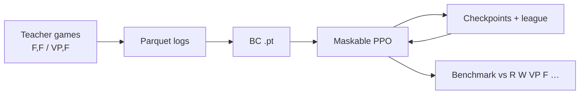

# Catanatron + Colonist.io 1v1 AI

[](https://coveralls.io/github/bcollazo/catanatron?branch=main)
[](https://catanatron.readthedocs.io/en/latest/?badge=latest)
[](https://colab.research.google.com/github/bcollazo/catanatron/blob/main/examples/Overview.ipynb)

**Catanatron** is a fast Settlers of Catan simulator and bot framework. **This fork** adds a full pipeline to train and evaluate a **Colonist.io-style 1v1** agent with behavioral cloning (BC), Maskable PPO, checkpoint leagues, and reproducible benchmarks.

| Goal | Where to start |
|------|----------------|
| Train a Colonist 1v1 bot | [Colonist 1v1 guide](docs/COLONIST_1V1.md) |
| Run thousands of classic Catan games | `catanatron-play` (below) |
| Play in the browser | Docker UI (below) |
| Upstream docs & API | [docs.catanatron.com](https://docs.catanatron.com) |

---

## What you get

- **Rules-accurate 1v1** — 15 VP, balanced dice, friendly robber (2 visible VP), 9-card discard limit, standard base map.
- **Teacher data** — Parquet logs from strong built-in bots (`F`, `VP`, …).
- **BC → PPO** — Warm-start reinforcement learning from imitation.
- **Self-play league** — Past checkpoints and curriculum opponents mixed during training.
- **Strength reports** — Win rates vs baselines with Wilson confidence intervals and pass/fail gates.

---

## Quick start (Colonist 1v1)

### 1. Install

Requires **Python 3.11+**.

```bash
git clone <your-repo-url>
cd catanatron-main
python -m venv venv
source venv/bin/activate   # Windows: venv\Scripts\activate

pip install -e ".[gym,dev,colonist]"
```

Optional terminal UI for the full workflow:

```bash
pip install -e ".[tui]"
```

### 2. Smoke test (about 1–2 minutes)

```bash
python examples/colonist_1v1_train.py --preset smoke --run-dir runs/smoke --skip-final-eval
```

### 3. Full pipeline (recommended order)

```bash
# A. Teacher games (use strong teachers, not W,W)
python examples/colonist_1v1_generate_data.py --num 5000 --teachers F,F --output data/c1_ff

# B. Behavioral cloning
python examples/colonist_1v1_bc.py --data-dir data/c1_ff --epochs 10 --out runs/my_run/bc.pt

# C. PPO with BC warm-start + mixed league
python examples/colonist_1v1_train.py --preset standard --run-dir runs/my_run \
  --bc-checkpoint runs/my_run/bc.pt --tensorboard

# D. Evaluate final policy
python examples/colonist_1v1_evaluate.py --agent L:runs/my_run/colonist_maskable_ppo.zip \
  --benchmark --gates --protocol milestone --report runs/my_run/final_eval.json
```

For presets, curricula, eval protocols, and run-folder layout, see **[docs/COLONIST_1V1.md](docs/COLONIST_1V1.md)**.

### Training TUI (optional)

```bash
python examples/colonist_1v1_tui.py
```

Browse runs, launch data generation / BC / PPO / eval, and inspect logs from `run_manifest.json` and `training_events.jsonl`.

---

## Colonist 1v1 rules (simulator)

| Setting | Value |
|---------|--------|
| Players | 2 |
| Victory points to win | 15 |
| Map | Base (`BASE`) |
| Dice | Balanced |
| Friendly robber | Yes — cannot steal from opponents with **≤ 2 visible VP** |
| Discard limit | 9 cards (on 7 or when over limit) |

Enable in code with `colonist_1v1=True` on the Gym env, or on the CLI:

```bash
catanatron-play --colonist-1v1 --players=F,F --num 100
```

---

## Training pipeline (overview)



**Artifacts in `runs/<name>/`:**

| Path | Purpose |
|------|---------|
| `checkpoints/ppo_colonist_*_steps.zip` | Periodic SB3 saves |
| `league/` | Rolling opponent pool for self-play |
| `colonist_maskable_ppo.zip` | Final trained policy |
| `bc.pt` + `bc.meta.json` | Behavioral cloning weights |
| `run_manifest.json` | Run metadata |
| `training_events.jsonl` | Phase / eval / promotion events |
| `final_benchmark.json` | Post-training strength report |

**AWS backup:** deploy a private S3 bucket with [`infra/aws/README.md`](infra/aws/README.md), then sync runs with `./scripts/aws_sync_run.sh runs/<name>` (set `CATANATRON_S3_BUCKET`).

---

## Bot player codes (`catanatron-play`)

Use these in `--players=...` or in eval as `L:path.zip` / `T:path.pt`.

| Code | Bot | Notes |
|------|-----|--------|
| `R` | Random | Weakest baseline |
| `W` | Weighted random | Favors builds when possible |
| `VP` | Victory-point greedy | Good mid baseline |
| `F` | Value function | Strong hand-crafted bot |
| `G:N` | Greedy playouts | `N` random rollouts per action |
| `M:N` | MCTS | `N` simulations |
| `AB:D` | Alpha–beta | Depth `D` |
| `L:file.zip` | MaskablePPO checkpoint | Learned agent |
| `T:file.pt` | Torch BC policy | Needs `.meta.json` beside `.pt` |

Colonist 1v1 training expects **exactly two** codes in `--players`, e.g. `F,F`.

---

## Classic Catanatron (4-player, CLI, library, UI)

### Command line

```bash
catanatron-play --players=R,R,R,W --num=100
catanatron-play --num 100 --output my-data/ --output-format json
```

### Python

```python
from catanatron import Game, RandomPlayer, Color

players = [RandomPlayer(c) for c in (Color.RED, Color.BLUE, Color.WHITE, Color.ORANGE)]
game = Game(players)
print(game.play())  # winning Color
```

### Gymnasium (4-player default env)

```bash
pip install -e ".[gym]"
```

```python
import random
import gymnasium
import catanatron.gym

env = gymnasium.make("catanatron/Catanatron-v0")
observation, info = env.reset()
for _ in range(1000):
    action = random.choice(info["valid_actions"])
    observation, reward, terminated, truncated, info = env.step(action)
    if terminated or truncated:
        observation, info = env.reset()
env.close()
```

See [catanatron/catanatron/gym/README.md](catanatron/catanatron/gym/README.md) and [docs.catanatron.com](https://docs.catanatron.com).

### Web UI (Docker)

```bash
docker compose up
```

Open [http://localhost:3000](http://localhost:3000).

---

## Documentation map

| Document | Audience |
|----------|----------|
| **[docs/COLONIST_1V1.md](docs/COLONIST_1V1.md)** | Colonist training, eval, presets, troubleshooting |
| [documentation/](documentation/) | GitBook-style guides (install, GUI, ML) |
| [catanatron/catanatron/gym/README.md](catanatron/catanatron/gym/README.md) | Gym + SB3 masking snippet |
| [docs/BLOG_POST.md](docs/BLOG_POST.md) | Project motivation and early experiments |
| [https://docs.catanatron.com](https://docs.catanatron.com) | Upstream reference |

---

## Development

```bash
pip install -e ".[web,gym,dev]"
coverage run --source=catanatron -m pytest tests/ && coverage report
```

Colonist-specific tests: `tests/test_colonist_1v1*.py`.

---

## Contributing & license

Contributing guide: [documentation/contributing.md](documentation/contributing.md).

GPL-3.0-or-later (see upstream [Catanatron](https://github.com/bcollazo/catanatron)).

Background reading: [5 Ways NOT to Build a Catan AI](https://medium.com/@bcollazo2010/5-ways-not-to-build-a-catan-ai-e01bc491af17).
