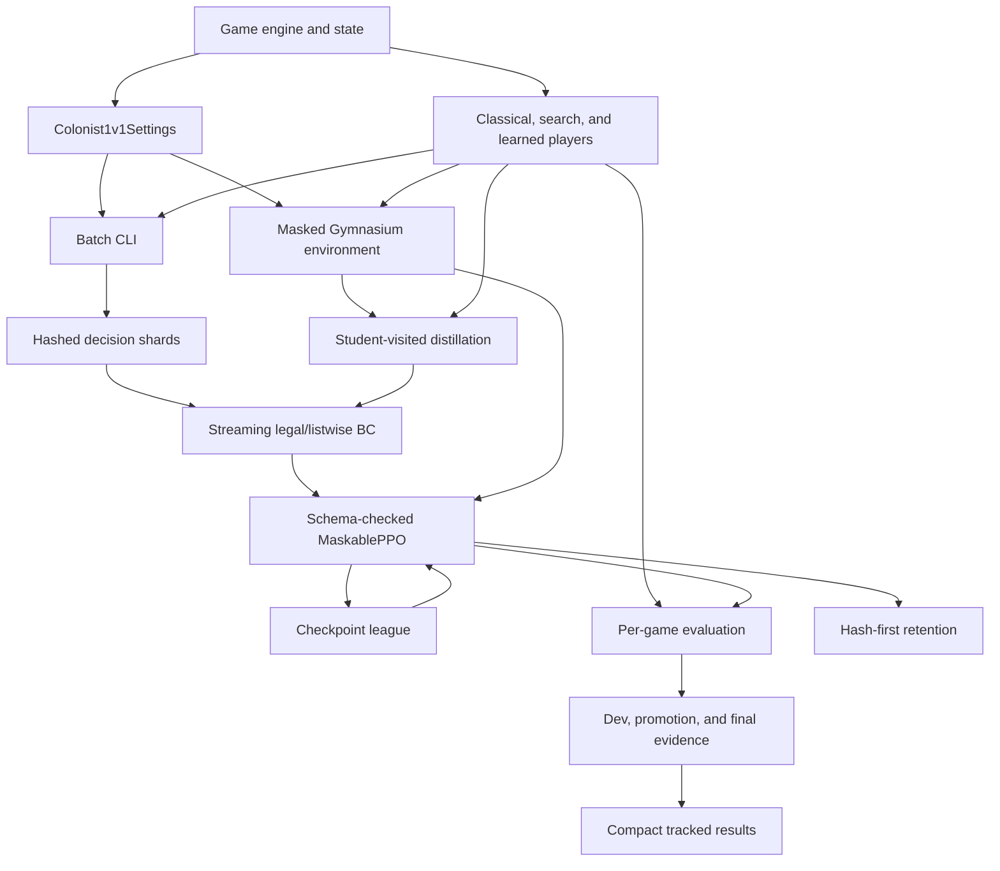

# Architecture

The repository keeps Catanatron's game engine and places a rules adapter, learning
environment, evidence layer, and experiment tooling around it. Learned artifacts are local
files; there is no service or external-game integration.

## Module boundaries

| Module | Responsibility |
|---|---|
| `game.py`, `state.py`, `apply_action.py`, `state_functions.py` | Game lifecycle and state transitions |
| `models/` | Board, map, actions, cards, players, and balanced-dice primitives |
| `players/` | Random, heuristic, chance-aware search, and checkpoint-backed players |
| `colonist_1v1.py` | Two-player rule settings and game factory |
| `cli/` | Batch simulation, player specs, and outcome accumulators |
| `features.py` | Versioned `raw` and `public_derived` vector profiles |
| `gym/envs/` | Stable action codec, masks, observation profiles, and Gym environment |
| `gym/colonist_rewards.py` | Actual/public VP reward functions |
| `gym/bc_training.py` | Shard inspection, grouped splits, streaming batches, and BC losses |
| `gym/model_schema.py` | Feature, action, rules, and combined schema identities |
| `gym/model_architectures.py` | Experimental action-conditioned scorer and board-tensor encoder |
| `gym/colonist_training.py` | Curricula, league, BC metadata, and run tracking |
| `gym/wrappers/self_play.py` | Opponent replacement at environment reset |
| `gym/distillation.py` | Deterministic DAgger-style student-visited data collection |
| `colonist_1v1_eval.py` | Per-game accounting, seed suites, confidence gates, paired comparisons, and reports |
| `gym/experiment_backlog.py` | Executable experiment definitions and evidence-derived statuses |
| `gym/provenance.py` | Git, Python, package, hardware, file, and environment hashes |
| `gym/result_artifacts.py` | Validation and compact publication of locked reports |
| `gym/artifact_retention.py` | Reversible hash-first checkpoint archival plans |
| `gym/tui_data.py`, `gym/tui_jobs.py` | Read-only run summaries and local subprocess control |

## Runtime and evidence flow

1. `Colonist1v1Settings` supplies rule arguments to `Game`.
2. `CatanatronEnv` exposes one player as the agent, advances its opponent internally,
   and emits a selected versioned observation profile.
3. The action codec maps engine actions to a stable 332-action policy head; invalid
   actions are masked.
4. Data generation writes game-grouped Parquet decisions, legal action sets, optional
   candidate values, configuration metadata, and hashes.
5. BC reads bounded shard batches, uses whole-game splits, selects the best validation
   epoch, and writes checkpoint metadata plus a schema sidecar.
6. PPO verifies warm-start/resume schemas, records every optimizer parameter, and can
   sample cached league, teacher, and baseline opponents.
7. Development, promotion, and final evaluation use disjoint deterministic seed namespaces.
   Every request becomes a per-game win, loss, draw/truncation, or error; no game disappears.
8. Only complete locked promotion/final reports with checkpoint hashes can become compact
   tracked evidence. Retention hashes every checkpoint before optional archival.

## Search and distillation boundary

Search is both an opponent and a possible teacher. Its stochastic transitions must match the
balanced dice deck and resource-weighted robber steal used by this rules preset. The strength
benchmark measures latency and held-out two-seat strength before search is admitted as a
teacher. Distillation accepts `F` or fixed-simulation MCTS only, because wall-clock search
budgets would make labels depend on machine load.

The distillation module stops at immutable data collection. BC/PPO consume that corpus in a
separate explicit step; the repository does not pretend that a full expert-iteration or
AlphaZero loop has run.

## Dependency boundaries

The core install depends on NetworkX, Click, and Rich. Optional extras are isolated by purpose:

| Extra | Adds |
|---|---|
| `gym` | Gymnasium, NumPy, pandas, and Parquet support |
| `colonist` | PyTorch, Stable-Baselines3, sb3-contrib, TensorBoard, and PyArrow |
| `tui` | Textual |
| `dev` | pytest, benchmarks, coverage, and Ruff/Black tooling |

Heavy dependencies are imported lazily where practical so engine-only simulations do not
require the training stack. `requirements/training-constraints.txt` defines the validated
training compatibility envelope; each run records its exact environment separately.

## Extension points

- Add a bot by subclassing `catanatron.models.player.Player` and implementing `decide`.
- Register a CLI player code with `catanatron.cli.register_cli_player`.
- Add public vector features through a named profile and update schema tests.
- Add a BC loss in `gym/bc_training.py` and preserve per-game split semantics.
- Add an evaluation protocol in `EVAL_PROTOCOLS` with tests for opponents, counts, and seed suite.
- Add an experiment definition and evidence predicate in `gym/experiment_backlog.py`, then
  regenerate the backlog table.
- Add rule behavior through the settings adapter when possible; engine changes need broader tests.

## Intentional non-goals

There is no browser client, HTTP API, replay database, hosted documentation site, cloud
deployment, or automated interaction with a third-party game service. Generated training
artifacts stay under ignored local directories except compact validated result summaries.

## Verification layers

- `make test-1v1` covers rules, Gym, features, schema loading, BC, distillation, backlog,
  artifacts, and evaluation integrity.
- `make test` also covers the generic engine, search players, replay determinism, CLI, and
  performance checks.
- `make test-installed` verifies imports from outside the checkout so local path leakage does
  not hide packaging failures.
- `.github/workflows/ci.yml` installs the constrained package on Python 3.11, then runs the
  installed-package probe, Ruff, and the full CPU suite on pushes to `main` and pull requests.
- A local smoke run validates the installed Torch/SB3 stack, checkpointing, and dashboard path;
  it is not replaced by CPU CI.
