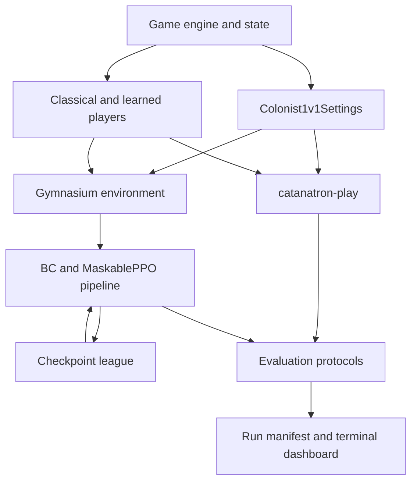

# Architecture

The repository keeps Catanatron's general game engine because the 1v1 environment, hand-crafted teachers, and search benchmarks all depend on it. The fork-specific surface is a small adapter and training layer around that engine.

## Module boundaries

| Module | Responsibility |
|---|---|
| `game.py`, `state.py`, `apply_action.py`, `state_functions.py` | Game lifecycle and state transitions |
| `models/` | Board, map, actions, cards, players, and balanced dice primitives |
| `players/` | Random, heuristic, search, and checkpoint-backed players |
| `colonist_1v1.py` | Two-player settings and game factory |
| `cli/` | Batch simulation, player specifications, and output accumulators |
| `gym/envs/` | Action-space conversion and Gymnasium environment |
| `gym/colonist_rewards.py` | Training reward functions |
| `gym/colonist_training.py` | BC metadata, curricula, checkpoint league, and run tracking |
| `gym/wrappers/self_play.py` | Opponent replacement at environment reset |
| `colonist_1v1_eval.py` | Matchups, fixed protocols, gates, confidence intervals, and reports |
| `gym/tui_data.py`, `gym/tui_jobs.py` | Read-only run summaries and local subprocess control for the TUI |

## Runtime flow

1. `Colonist1v1Settings` supplies rule arguments to `Game`.
2. `CatanatronEnv` exposes one player as the learning agent and advances the opponent internally.
3. The action-space module maps engine actions to a stable discrete policy head; invalid actions are masked.
4. Teacher simulations write vector features and chosen actions to Parquet.
5. BC trains the same policy-side MLP shape later used by MaskablePPO.
6. PPO checkpoints are copied into a bounded league and sampled as future opponents.
7. Evaluation instantiates learned or classical players through the same CLI player specification parser.
8. JSON manifests and JSONL events make runs inspectable without a database service.

## Dependency boundaries

The core install depends only on NetworkX, Click, and Rich. Optional dependency groups are isolated by purpose:

| Extra | Adds |
|---|---|
| `gym` | Gymnasium, NumPy, pandas, and Parquet support |
| `colonist` | PyTorch, Stable-Baselines3, sb3-contrib, TensorBoard, and PyArrow |
| `tui` | Textual |
| `dev` | pytest, benchmarks, coverage, and Black |

Heavy dependencies are imported lazily where practical so engine-only simulations do not need the ML stack.

## Extension points

- Add a bot by subclassing `catanatron.models.player.Player` and implementing `decide`.
- Register a player code with `catanatron.cli.register_cli_player`.
- Add training signals by passing a reward function in the Gym config.
- Add an evaluation protocol in `EVAL_PROTOCOLS` and cover its opponent set and default game count with tests.
- Add rule behavior through the settings adapter when possible; engine changes require broader regression coverage.

## Intentional non-goals

This repository does not provide a browser client, HTTP API, replay database, hosted documentation site, cloud deployment, or automated interaction with a third-party game service. Training artifacts stay on the local filesystem.

## Verification layers

- `make test-1v1` covers the preset, balanced dice, reward shaping, self-play, checkpoint metadata, TUI data, and evaluation behavior.
- `make test` also covers the retained generic engine, feature extraction, search players, CLI output, replay determinism, and performance benchmarks.
- A training smoke run validates the installed PyTorch/SB3 stack and artifact-writing path.

The test suite is intentionally local. CI workflows were removed with the unrelated upstream deployment surface; run the verification commands before pushing changes that affect models or rules.
