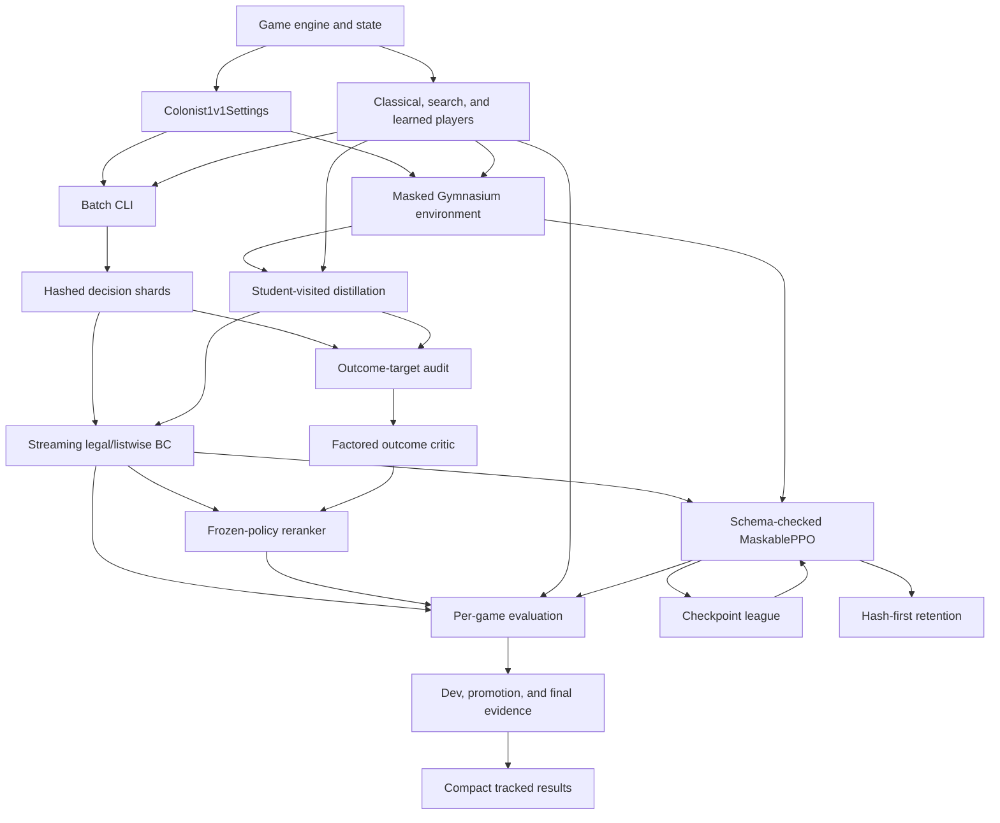

# Architecture

The repository keeps Catanatron's game engine and places a rules adapter, learning
environment, evidence layer, and experiment tooling around it. Learned artifacts are local
files; there is no service or external-game integration.

```mermaid
flowchart TD
    Core["Game engine and state"] --> Rules["Colonist1v1Settings"]
    Core --> Players["Classical, search, and learned players"]
    Rules --> CLI["Batch CLI"]
    Rules --> Gym["Masked Gymnasium environment"]
    Players --> CLI
    Players --> Gym
    CLI --> Data["Hashed decision shards"]
    Gym --> Distill["Student-visited distillation"]
    Players --> Distill
    Data --> BC["Streaming legal/listwise BC"]
    Distill --> BC
    Data --> Targets["Outcome-target audit"]
    Distill --> Targets
    Targets --> Critic["Factored outcome critic"]
    BC --> Reranker["Frozen-policy reranker"]
    Critic --> Reranker
    BC --> Eval
    Reranker --> Eval
    BC --> PPO["Schema-checked MaskablePPO"]
    Gym --> PPO
    PPO --> League["Checkpoint league"]
    League --> PPO
    Players --> Eval["Per-game evaluation"]
    PPO --> Eval
    Eval --> Gates["Dev, promotion, and final evidence"]
    Gates --> Results["Compact tracked results"]
    PPO --> Artifacts["Hash-first retention"]
```

## Module boundaries

| Module | Responsibility |
|---|---|
| `game.py`, `state.py`, `apply_action.py`, `state_functions.py` | Game lifecycle and state transitions |
| `models/` | Board, map, actions, cards, players, and balanced-dice primitives |
| `players/` | Random, heuristic, chance-aware search, and checkpoint-backed players |
| `colonist_1v1.py` | Two-player rule settings and game factory |
| `cli/` | Batch simulation, player specs, and outcome accumulators |
| `features.py` | Versioned `raw` and `public_derived` vector profiles |
| `gym/envs/` | Stable action codec, masks, observation profiles, and Gym environment |
| `gym/colonist_rewards.py` | Actual/public VP reward functions |
| `gym/bc_training.py` | Shard inspection, grouped splits, streaming batches, and BC losses |
| `gym/model_schema.py` | Feature, action, rules, and combined schema identities |
| `gym/model_architectures.py` | Flat/factored BC builders, topology-aware road/robber residuals, action-conditioned/value heads, and board-tensor encoder |
| `gym/colonist_training.py` | Curricula, league, BC metadata, and run tracking |
| `gym/wrappers/self_play.py` | Opponent replacement at environment reset |
| `gym/distillation.py` | Deterministic DAgger-style student-visited data collection |
| `gym/outcome_target_audit.py` | Outcome-label recovery, coverage, leakage, balance, and public-score baselines |
| `gym/outcome_critic.py` | Whole-game split planning, streaming outcome batches, losses, and critic metrics |
| `colonist_1v1_eval.py` | Per-game accounting, seed suites, confidence gates, paired comparisons, and reports |
| `gym/experiment_backlog.py` | Executable experiment definitions and evidence-derived statuses |
| `gym/provenance.py` | Git, Python, package, hardware, file, and environment hashes |
| `gym/result_artifacts.py` | Validation and compact publication of locked reports |
| `gym/artifact_retention.py` | Reversible hash-first checkpoint archival plans |
| `gym/tui_data.py`, `gym/tui_jobs.py` | Read-only run summaries and local subprocess control |

## Runtime and evidence flow

1. `Colonist1v1Settings` supplies rule arguments to `Game`.
2. `CatanatronEnv` exposes one player as the agent, advances its opponent internally,
   and emits a selected versioned observation profile.
3. The action codec maps engine actions to a stable 332-action policy head; invalid
   actions are masked.
4. Data generation writes game-grouped Parquet decisions, legal action sets, optional
   candidate values, configuration metadata, and hashes.
5. BC reads bounded shard batches, uses whole-game splits, selects the best validation
   epoch, and writes checkpoint metadata plus a schema sidecar. The action-conditioned
   architecture preserves the global MLP state encoder but replaces unrelated flat action
   logits with a shared state/action dot-product head, which can score the full codec or
   only legal candidates. A conservative update can
   load a schema-compatible parent and include the unchanged parent as epoch 0, preventing
   a worse trained epoch from replacing it. The factored architecture separately encodes
   board-entity/global feature groups and trains trajectory win/VP-margin values. The spatial
   edge residual instead loads and optionally freezes a byte-compatible MLP, then changes only
   the 72 `BUILD_ROAD` logits using edge ownership, endpoint buildings, adjacent tiles, global
   context, and learned edge identity. The analogous robber residual changes only the 57
   `MOVE_ROBBER` logits using destination-tile state, victim presence, global context, and learned
   tile identity. Both residuals start at exactly zero, so epoch 0 is exactly the parent. Every
   layout remains loadable through the normal Torch checkpoint player.
6. An outcome audit recovers legacy DAgger win labels from immutable game manifests,
   pairs base-corpus seat trajectories for VP-margin labels, and keeps related trajectories
   in one whole-game split group. A separate factored critic can then learn win probability
   and VP margin without changing any policy parameter. A composite `C:` player verifies
   both checkpoints and all four metadata/schema sidecars, scores the frozen policy's top-k
   actions through public-only successor expectation, falls back to the frozen policy outside
   that boundary, and switches only above its fixed critic-improvement threshold. A separate
   `O:` wrapper can route exactly the two initial
   build prompts to the default deterministic value function while leaving every later
   decision on a hash-verified frozen policy.
   The `N:` wrapper runs policy-guided PUCT only across deterministic same-turn actions.
   Mixed roots containing a chance or hidden-transfer action fall back to the frozen policy,
   and opponent turns are leaves. Its public-F option omits resource-composition hand synergy,
   making the leaf invariant to an opponent's hidden resource mix.
   The experimental `Q:` wrapper widens that exact run-55 search to public dice outcomes and
   a development-card belief distribution formed from the public deck size plus opponents'
   hidden unplayed-card counts. It uses a custom public-only successor spectrum, never the
   engine's omniscient generic spectrum, while robber movement, Monopoly transfers, and
   opponent turns remain outside the search boundary. Run 56 validated the mechanism but did
   not clear its locked paired-promotion interval, so `N:` remains the retained wrapper.
7. BC can scope a bounded loss/VP-deficit multiplier to explicitly named fresh
   student-visited paths. Native terminal targets are verified before training, the weighting
   distribution is recorded, and base plus validation/test rows remain untouched.
8. PPO verifies warm-start/resume schemas, records every optimizer parameter, and can
   sample cached league, teacher, and baseline opponents.
9. Development, promotion, and final evaluation use disjoint deterministic seed namespaces;
   numbered seed rounds provide fresh locked holdouts for sequential model decisions.
   Every request becomes a per-game win, loss, draw/truncation, or error; no game disappears.
   Candidate and baseline can run on identical schedules and use a paired-bootstrap
   lower-bound gate. BC checkpoints can likewise be re-evaluated on one exact expanded
   validation/test plan before a new gameplay schedule is consumed.
10. Only complete locked promotion/final reports with checkpoint hashes can become compact
   tracked evidence. Retention hashes every checkpoint before optional archival.

## Search and distillation boundary

Search is both an opponent and a possible teacher. Its stochastic transitions must match the
balanced dice deck and resource-weighted robber steal used by this rules preset. The strength
benchmark measures latency and held-out two-seat strength before search is admitted as a
teacher. Distillation accepts `F` or fixed-simulation MCTS only, because wall-clock search
budgets would make labels depend on machine load.

Teacher RNG is isolated from the behavior trajectory. Collection can restrict labels to states
where a named action family is legal, skip forced decisions before invoking the teacher, and
record decision counts plus teacher-latency summaries. Matched teacher-label comparison then
requires identical game/decision keys, state hashes, legal actions, and behavior actions before
reporting agreement.

The distillation module stops at immutable data collection. New shards also carry terminal
win and VP-margin targets when a game completes; legacy DAgger win targets can be recovered
from the hashed game manifests. BC, the outcome critic, and PPO consume these corpora in
separate explicit steps; the repository does not pretend that a full expert-iteration or
AlphaZero loop has run.

## Dependency boundaries

The core install depends on NetworkX, Click, and Rich. Optional extras are isolated by purpose:

| Extra | Adds |
|---|---|
| `gym` | Gymnasium, NumPy, pandas, and Parquet support |
| `colonist` | PyTorch, Stable-Baselines3, sb3-contrib, TensorBoard, and PyArrow |
| `tui` | Textual |
| `dev` | pytest, benchmarks, coverage, and Ruff/Black tooling |

Heavy dependencies are imported lazily where practical so engine-only simulations do not
require the training stack. `requirements/training-constraints.txt` defines the validated
training compatibility envelope; each run records its exact environment separately.

## Extension points

- Add a bot by subclassing `catanatron.models.player.Player` and implementing `decide`.
- Register a CLI player code with `catanatron.cli.register_cli_player`.
- Add public vector features through a named profile and update schema tests.
- Add a BC loss in `gym/bc_training.py` and preserve per-game split semantics.
- Add an evaluation protocol in `EVAL_PROTOCOLS` with tests for opponents, counts, and seed suite.
- Add an experiment definition and evidence predicate in `gym/experiment_backlog.py`, then
  regenerate the backlog table.
- Add rule behavior through the settings adapter when possible; engine changes need broader tests.

## Intentional non-goals

There is no browser client, HTTP API, replay database, hosted documentation site, cloud
deployment, or automated interaction with a third-party game service. Generated training
artifacts stay under ignored local directories except compact validated result summaries.

## Verification layers

- `make test-1v1` covers rules, Gym, features, schema loading, BC, distillation, backlog,
  artifacts, and evaluation integrity.
- `make test` also covers the generic engine, search players, replay determinism, CLI, and
  performance checks.
- `make test-installed` verifies imports from outside the checkout so local path leakage does
  not hide packaging failures.
- `.github/workflows/ci.yml` installs the constrained package on Python 3.11, then runs the
  installed-package probe, Ruff, and the full CPU suite on pushes to `main` and pull requests.
- A local smoke run validates the installed Torch/SB3 stack, checkpointing, and dashboard path;
  it is not replaced by CPU CI.
