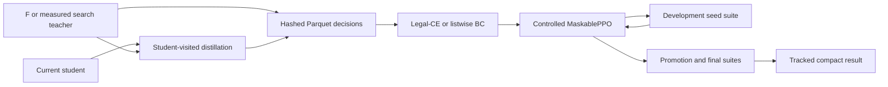

# Training and evaluation

This guide covers the supported evidence path from simulated decisions to a measured
Colonist-style 1v1 policy. Tooling being available does not mean an experiment has run;
current experiment status is in [the results log](RESULTS_LOG.md).

## Install a reproducible environment

Python 3.11 or newer is required. The constraints file is a validated compatibility
envelope; each run still records the exact installed package set.

```bash
python3 -m venv .venv
source .venv/bin/activate
python -m pip install --upgrade pip
python -m pip install -c requirements/training-constraints.txt \
  -e ".[dev,gym,colonist,tui]"
```

The base package contains the engine and CLI. The extras add Gymnasium/Parquet (`gym`),
PyTorch/SB3 (`colonist`), tests/lint (`dev`), and the optional Textual dashboard (`tui`).

## Evidence pipeline



Use one `runs/<name>` directory per experiment. Keep the configuration, schema, input
hashes, checkpoint, and locked evaluation together.

## Observation profiles and schema identity

Every newly generated learned artifact is bound to ordered feature, action, and rules schemas.
A matching tensor shape is not enough: warm-start, resume, and inference reject changed hashes.

| Profile | Contents | Intended use |
|---|---|---|
| `raw` | Existing vector state features | Control and compatibility baseline |
| `public_derived` | `raw` plus public production and road-reachability features | Cheap representation treatment |

Pass the same `--feature-profile` to data generation, BC, and PPO. Generated datasets carry
`dataset_sha256`, individual shard hashes, provenance, and the model schema hash. BC writes
`<checkpoint>.schema.json`; PPO writes `model_schema.json` plus adjacent checkpoint schemas.
`--allow-legacy-schema` exists only for deliberate unsafe compatibility work and should not
be used for promotion candidates.

## 1. Generate teacher decisions

Legal-action data:

```bash
python examples/colonist_1v1_generate_data.py \
  --num 5000 --teachers F,F --seed 101 \
  --feature-profile raw \
  --output data/c1_ff
```

Candidate-scored data for listwise learning:

```bash
python examples/colonist_1v1_generate_data.py \
  --num 2000 --teachers F,F --seed 101 \
  --choices-only --score-candidates \
  --feature-profile raw \
  --output data/c1_ff_scored
```

The generator uses deterministic game seeds and writes atomic Parquet shards plus
`dataset_meta.json`. `--resume` validates the existing configuration before continuing.
Candidate scoring evaluates every legal action with the F leaf evaluator and is much slower.

| Option | Meaning |
|---|---|
| `--num` | Number of games; default `100` |
| `--teachers` | Exactly two player specs; default `F,F` |
| `--seed` | Base seed; game `i` uses the deterministic schedule from that base |
| `--shard-games` | Games per atomic Parquet shard; default `100` |
| `--resume` | Continue only after metadata and schema validation |
| `--choices-only` | Retain genuine multi-action decisions only |
| `--score-candidates` | Add legal-action F values for regret/listwise training |
| `--feature-profile` | `raw` or `public_derived` |
| `--include-board-tensor` | Also store the experimental flattened board tensor |

## 2. Train baseline and decision-focused BC

The BC loader streams selected Parquet shards through bounded batches instead of building
one full in-memory tensor. Splits are deterministic and grouped by game, preventing decisions
from one game leaking across train, validation, and test sets.

### Legal-CE baseline

```bash
python examples/colonist_1v1_bc.py \
  --data-dir data/c1_ff \
  --loss legal_ce --epochs 10 \
  --val-fraction 0.1 --test-fraction 0.1 \
  --split-seed 101 --seed 101 --device auto \
  --feature-profile raw \
  --out runs/bc-legal/bc.pt --run-dir runs/bc-legal
```

### Candidate-value listwise treatment

```bash
python examples/colonist_1v1_bc.py \
  --data-dir data/c1_ff_scored \
  --loss listwise --listwise-temperature 0.25 \
  --tie-tolerance 1e-6 --hard-states --epochs 10 \
  --val-fraction 0.1 --test-fraction 0.1 \
  --split-seed 101 --seed 101 --device auto \
  --feature-profile raw \
  --out runs/bc-listwise/bc.pt --run-dir runs/bc-listwise
```

| Loss | Behavior | Data requirement |
|---|---|---|
| `cross_entropy` | Legacy CE over all 332 actions | Legacy or v2 data; compatibility only |
| `legal_ce` | Masks logits to the recorded legal set before CE | `LEGAL_ACTIONS` |
| `listwise` | Matches a temperature-scaled distribution over candidate values, with tie handling | `LEGAL_ACTIONS` and `CANDIDATE_VALUES` |
| `auto` | Uses `legal_ce` for v2 data, otherwise legacy CE | Any supported dataset |

`--device auto` selects CUDA, then MPS, then CPU. Python, NumPy, and Torch receive the same
seed. `--hard-states` changes training weights only; validation/test remain unweighted.
The saved checkpoint is the best validation epoch, selected by `mean_regret` when candidate
values exist and otherwise by validation loss.

BC outputs:

- `bc.pt`: best-epoch PyTorch state;
- `bc.meta.json`: loss, seeds, device, split sizes, full validation/test metrics,
  selected epoch, input shard hashes, and `dataset_sha256`;
- `bc.schema.json`: feature/action/rules identities;
- run manifest/events when `--run-dir` is supplied.

Raw action accuracy is not a promotion gate. Compare legal-choice accuracy, top-3 accuracy,
mean regret, and then locked two-seat gameplay. When launching backlog experiment `20` or
`21`, supply both artifacts so the gate can compare metadata directly:

```bash
python examples/colonist_1v1_backlog.py start 20-hard-bc-actual-s101 \
  --bc-checkpoint "$PWD/runs/bc-listwise/bc.pt" \
  --bc-baseline-checkpoint "$PWD/runs/bc-legal/bc.pt"
```

## 3. Collect DAgger/search-distillation data

The distillation command lets the current student control its seat while a separate teacher
labels each visited legal-action set. Teacher work runs under an isolated deterministic RNG
stream, iterations are immutable, and replay manifests contain agent, schema, and shard hashes.

```bash
# Inspect resolved identities and seeds without playing games.
python examples/colonist_1v1_distill.py \
  --student T:runs/bc-legal/bc.pt \
  --teacher M:50:False:base_fn \
  --opponent F --iteration 0 --games 20 \
  --output data/distill --dry-run

# Collect, then verify, one small iteration.
python examples/colonist_1v1_distill.py \
  --student T:runs/bc-legal/bc.pt \
  --teacher M:50:False:base_fn \
  --opponent F --iteration 0 --games 20 \
  --output data/distill

python examples/colonist_1v1_distill.py \
  --output data/distill --verify
```

Teachers are limited to `F` or fixed-simulation MCTS. Wall-clock MCTS teachers are rejected
because machine load would change labels. This CLI implements trustworthy data collection,
not an automatic large expert-iteration training loop.

## 4. Train MaskablePPO

```bash
python examples/colonist_1v1_train.py \
  --preset standard --run-dir runs/my_bot \
  --bc-checkpoint runs/bc-listwise/bc.pt \
  --feature-profile raw --tensorboard
```

Named presets set runtime and evaluation cadence, then enable the mixed league:

| Preset | Timesteps | Envs | Save every | Dev eval every | Dev games | Curriculum |
|---|---:|---:|---:|---:|---:|---|
| `smoke` | 20,000 | 1 | 10,000 | 10,000 | 10 | `balanced` |
| `standard` | 500,000 | 4 | 50,000 | 50,000 | 50 | `balanced` |
| `strong` | 5,000,000 | 8 | 100,000 | 250,000 | 100 | `strong` |
| `overnight` | 20,000,000 | 8 | 250,000 | 500,000 | 150 | `strong` |

Presets do not silently change PPO optimization parameters. Defaults, all recorded in
`run_manifest.json`, are:

| Parameter | Default |
|---|---:|
| learning rate | `3e-4` |
| gamma | `0.99` |
| GAE lambda | `0.95` |
| rollout steps per environment | `2048` |
| batch size | `64` |
| epochs per update | `10` |
| entropy coefficient | `0.0` |
| clip range | `0.2` |
| value coefficient | `0.5` |
| maximum gradient norm | `0.5` |

Override them explicitly with `--learning-rate`, `--gamma`, `--gae-lambda`, `--n-steps`,
`--batch-size`, `--n-epochs`, `--ent-coef`, `--clip-range`, `--vf-coef`, and
`--max-grad-norm`. Use `--preset custom` when also setting runtime cadence manually.

Other important options:

| Option | Purpose |
|---|---|
| `--bc-checkpoint` | Strict schema-checked BC warm-start |
| `--resume-checkpoint` | Strict schema-checked PPO continuation |
| `--promotion-eval-freq` | Run a locked lower-bound promotion suite during training |
| `--final-eval-games` | Explicitly override final protocol count; omitted means use protocol count |
| `--final-gate-mode` | `lower_bound` by default; `point` is diagnostic |
| `--visible-vp-reward` | Use public instead of actual VP for shaping |
| `--curriculum` | `none`, `balanced`, `strong`, or `self_play` |
| `--vec-env` | `auto`, `dummy`, or `subproc` |
| `--vec-start-method` | `auto`, `spawn`, `forkserver`, or `fork` |
| `--skip-final-eval` | Omit final evidence; suitable only for smoke/diagnostic runs |

Checkpoint, development evaluation, and promotion cadences are independent. A due evaluation
is not delayed until the next save interval.

## 5. Evaluate without leaking selection evidence

| Suite | Purpose | Default gate behavior |
|---|---|---|
| `dev` | Frequent iteration and local checkpoint selection | Point estimates; never final evidence |
| `promotion` | Locked candidate promotion | Wilson lower bound in the training callback |
| `final` | Final benchmark and tracked result | Wilson lower bound by training default |

The suites use disjoint deterministic seed namespaces. Manual CLI evaluation defaults to
point gates for compatibility, so request lower-bound gates explicitly when producing evidence:

```bash
python examples/colonist_1v1_evaluate.py \
  --agent L:runs/my_bot/colonist_maskable_ppo.zip \
  --protocol milestone --gates \
  --eval-kind final --gate-mode lower_bound \
  --report runs/my_bot/final_benchmark.json
```

| Protocol | Opponents | Games each | Intended use |
|---|---|---:|---|
| `fast` | R, W, VP, F | 50 | Development checks |
| `milestone` | R, W, VP, F, G:25 | 100 | Promotion decisions |
| `full` | R, W, VP, F, G:25, M:200, AB:2 | 200 | Expensive final comparison |

If `--num-games` is omitted, the protocol count is used. Training's `--eval-games` applies
only to development evaluation; `--final-eval-games` is the explicit final override.

Every requested game stays in the denominator. Turn-limit games are recorded as
draw/truncation with final VP, and evaluator failures are recorded as errors rather than
silently improving the win rate. Reports contain per-game seat, seed, schedule identity,
outcome, turns, and VP. Pair candidate and baseline reports only on shared seat/seed schedules;
the evaluation library can bootstrap a paired matchup interval, while the reward-backlog gate
uses a deterministic weighted mean of paired per-game outcome deltas.

## 6. Publish evidence and retain artifacts

Only complete promotion/final reports with checkpoint hashes are publishable:

```bash
python examples/colonist_1v1_publish_result.py \
  runs/my_bot/final_benchmark.json \
  --output docs/results/my-bot.json
```

The compact tracked JSON keeps aggregate results and a hash of the omitted per-game rows.
Both accepted and rejected models are useful evidence. Development reports, missing games,
one-seat evaluations, evaluator errors, gate/protocol drift, forged aggregates, or absent
checkpoint hashes are rejected.

Plan retention before moving anything:

```bash
python examples/colonist_1v1_artifacts.py runs/my_bot \
  --keep-latest 3 --pin runs/my_bot/colonist_maskable_ppo.zip
```

Review the hash-first JSON plan, then add `--apply` to move superseded checkpoints into a
timestamped `run_dir/archive/` tree. The command never deletes artifacts and conservatively
keeps final, promoted, league, pinned, and latest checkpoints.

## Run artifacts and provenance

```text
runs/my_bot/
├── colonist_maskable_ppo.zip
├── colonist_maskable_ppo.schema.json
├── model_schema.json
├── environment.lock.txt
├── run_manifest.json
├── training_events.jsonl
├── models_index.jsonl
├── checkpoints/
├── league/
│   ├── index.json
│   └── promoted/
├── eval_reports/
├── final_benchmark.json
├── artifact_retention_plan.json
└── tb/
```

The manifest records command/configuration, exact PPO parameters, Git branch/commit/dirty
state, Python executable/version, package-set hash, hardware/CUDA/MPS details, schema hashes,
and final checkpoint hash. `environment.lock.txt` records the exact installed distributions.

## Dashboard and verification

```bash
python examples/colonist_1v1_tui.py --run-dir runs/my_bot
python examples/colonist_1v1_tui.py --run-dir runs/my_bot --once
```

Before GPU access:

```bash
make test-gpu-ready
python examples/colonist_1v1_backlog.py check docs/GPU_EXPERIMENT_BACKLOG.md
```

GitHub Actions installs the package under Python 3.11 with the training constraints, verifies
an import from outside the checkout, runs Ruff, and runs the full CPU test suite. Locally:

```bash
make test-installed
make lint
make test
```

## Troubleshooting

| Symptom | Check |
|---|---|
| No Parquet shards found | Confirm `--data-dir`, completed `dataset_meta.json`, and shard hashes |
| Schema mismatch | Match feature profile/rules/action codec; do not bypass with legacy mode for evidence |
| Listwise reports no usable rows | Generate with `--score-candidates` and retain multi-action choices |
| BC memory pressure | Reduce `--batch-size`; shards are streamed but each active batch still uses memory |
| PPO memory pressure | Reduce `--n-envs` or rollout steps, recording the changed configuration |
| Full evaluation is slow | Use `dev`/`fast` for iteration and locked milestone/full only for decisions |
| Report will not publish | Check eval kind/seed suite, game accounting, per-game rows, errors, and checkpoint hash |

Run `make test-1v1` after changing rules, features, rewards, checkpoint loading, training,
search chance behavior, or evaluation accounting.
