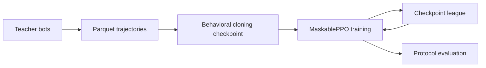

# Training and evaluation

This guide covers the supported path from simulated teacher games to a measured Colonist-style 1v1 policy.

## Install

From the repository root:

```bash
python3 -m venv .venv
source .venv/bin/activate
python -m pip install -e ".[dev,gym,colonist,tui]"
```

The base package contains the engine and CLI. The extras add Gymnasium and Parquet support (`gym`), PyTorch/SB3 training (`colonist`), tests and formatting (`dev`), and the optional Textual dashboard (`tui`).

## Pipeline



Use a separate `runs/<name>` directory for each experiment. A run directory is both the model output location and the audit trail used by the TUI.

## 1. Generate teacher data

```bash
python examples/colonist_1v1_generate_data.py \
  --num 5000 \
  --teachers F,F \
  --seed 0 \
  --output data/c1_ff
```

The script invokes the active Python interpreter, uses deterministic seeds, and writes atomic 100-game Parquet shards plus `dataset_meta.json`. Re-run an interrupted matching configuration with `--resume`. Prefer `F`, `VP`, or a deliberately chosen search player over weak random teachers. The generic `catanatron-play` command retains its one-file-per-game default for compatibility.

| Option | Meaning |
|---|---|
| `--num` | Number of games; default `100` |
| `--teachers` | Exactly two player specifications; default `F,F` |
| `--output` | Dataset directory |
| `--seed` | Base game seed; game `i` uses `seed + i`; default `0` |
| `--shard-games` | Games per atomic Parquet shard; default `100` |
| `--resume` | Validate metadata and continue an interrupted dataset |
| `--choices-only` | Drop forced actions while writing; off by default |
| `--include-board-tensor` | Include the larger board-tensor feature set |

The generator refuses to reuse a populated directory unless `--resume` is supplied. Resume validates teachers, seed, requested games and schema-affecting options before continuing from the next seed.

## 2. Behavioral cloning

```bash
python examples/colonist_1v1_bc.py \
  --data-dir data/c1_ff data/c1_vp_f \
  --epochs 10 \
  --out runs/my_bot/bc.pt \
  --run-dir runs/my_bot
```

Behavioral cloning trains a multilayer perceptron to predict the teacher's legal action from the vector observation.

Key outputs:

- `bc.pt`: PyTorch weights;
- `bc.meta.json`: observation size, action size, hidden layers, row counts, and validation metrics;
- run events under `--run-dir`, when supplied.

The default hidden layers are `512 512` and the action head is `332`. Keep `--hidden` consistent when using the checkpoint to warm-start PPO.

## 3. PPO and league training

```bash
python examples/colonist_1v1_train.py \
  --preset standard \
  --run-dir runs/my_bot \
  --bc-checkpoint runs/my_bot/bc.pt \
  --tensorboard
```

Named presets set the main runtime parameters and enable mixed-league sampling:

| Preset | Timesteps | Environments | Save every | Evaluate every | Eval games | Curriculum |
|---|---:|---:|---:|---:|---:|---|
| `smoke` | 20,000 | 1 | 10,000 | 10,000 | 10 | `balanced` |
| `standard` | 500,000 | 4 | 50,000 | 50,000 | 50 | `balanced` |
| `strong` | 5,000,000 | 8 | 100,000 | 250,000 | 100 | `strong` |
| `overnight` | 20,000,000 | 8 | 250,000 | 500,000 | 150 | `strong` |

Use `--preset custom` when you need explicit `--timesteps`, `--n-envs`, `--save-freq`, or `--eval-freq` values. Named presets intentionally replace those values.

Important options:

| Option | Purpose |
|---|---|
| `--bc-checkpoint` | Warm-start the policy network from BC weights |
| `--resume-checkpoint` | Continue from a MaskablePPO checkpoint |
| `--mixed-league` | Sample league, teacher, and baseline opponents on reset |
| `--curriculum` | `none`, `balanced`, `strong`, or `self_play` |
| `--teacher-codes` | Replace the curriculum's teacher set |
| `--league-checkpoints` | Seed the league with existing checkpoints |
| `--league-size` | Maximum rolling checkpoint count; default `8` |
| `--visible-vp-reward` | Shape rewards using public rather than actual VP |
| `--vec-env` | `auto`, `dummy`, or `subproc`; auto uses subprocesses for multiple envs |
| `--skip-final-eval` | Skip the post-training report for quick iterations |

MaskablePPO receives only legal actions. The default shaped reward is terminal `+1/-1` plus `0.02 ×` the learning player's victory-point change.

## 4. Evaluate strength

Evaluate a single opponent:

```bash
python examples/colonist_1v1_evaluate.py \
  --agent L:runs/my_bot/colonist_maskable_ppo.zip \
  --opponent F --num-games 200
```

Evaluate a standard battery:

```bash
python examples/colonist_1v1_evaluate.py \
  --agent L:runs/my_bot/colonist_maskable_ppo.zip \
  --protocol milestone --gates \
  --report runs/my_bot/evaluation.json
```

If `--num-games` is omitted, the selected protocol supplies the count per opponent.

| Protocol | Opponents | Games per opponent | Intended use |
|---|---|---:|---|
| `fast` | R, W, VP, F | 50 | Frequent progress checks |
| `milestone` | R, W, VP, F, G:25 | 100 | Model promotion decisions |
| `full` | R, W, VP, F, G:25, M:200, AB:2 | 200 | Expensive final comparison |

`--gates` applies the repository's current minimum win rates: 90% vs R, 70% vs W, 60% vs VP, and 52% vs F, G:25, M:200, and AB:2. Protocols use a fixed seed schedule by default, and reports record it alongside Wilson score intervals, average victory-point margin, and a weighted score. Override with `--seed` only when deliberately creating another evaluation replicate.

These are regression benchmarks, not a neutral tournament rating. The evaluated agent plays both explicitly fixed seats by default, and the simulator is only an approximation of an external service. Compare models with the same protocol seed, commit, and rule settings.

## Run artifacts

A typical run contains:

```text
runs/my_bot/
├── bc.pt
├── bc.meta.json
├── colonist_maskable_ppo.zip
├── run_manifest.json
├── training_events.jsonl
├── models_index.jsonl
├── checkpoints/
├── league/
│   ├── index.json
│   └── promoted/
├── eval_reports/
├── final_benchmark.json
└── tb/
```

The exact optional files depend on the enabled phases. Git ignores `data/` and `runs/`; back them up separately if a checkpoint matters.

## Training dashboard

```bash
python examples/colonist_1v1_tui.py --run-dir runs/my_bot
```

The Textual app discovers runs, launches pipeline commands, tails job output, and summarizes the manifest and model registry. For a non-interactive snapshot:

```bash
python examples/colonist_1v1_tui.py --run-dir runs/my_bot --once
```

## Reproducible local pipeline

`scripts/local_strength_eval.sh` runs teacher generation, BC, PPO, and four baseline evaluations. Override its environment variables to control cost:

```bash
RUN_DIR=runs/local \
NUM_GAMES=500 \
PPO_STEPS=500000 \
EVAL_GAMES=100 \
./scripts/local_strength_eval.sh
```

## Troubleshooting

| Symptom | Check |
|---|---|
| No Parquet files found | Confirm `--output`, `dataset_meta.json`, and the latest run marker |
| BC dimensions do not load into PPO | Match BC and PPO `--hidden` values and retain the `.meta.json` file |
| Strong baseline win rate remains low | Improve teacher quality, dataset size, and curriculum before increasing runtime alone |
| Full evaluation is slow | Use `fast` during iteration and reserve `full` for final comparisons |
| Memory pressure with several environments | Reduce `--n-envs` or use a smaller preset |

Run `make test-1v1` after changing rules, features, rewards, checkpoint loading, or evaluation behavior.
