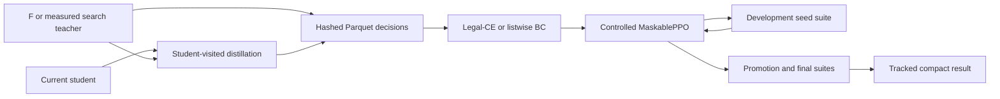

# Training and evaluation

This guide covers the supported evidence path from simulated decisions to a measured
Colonist-style 1v1 policy. Tooling being available does not mean an experiment has run;
current experiment status is in [the results log](RESULTS_LOG.md).

## Install a reproducible environment

Python 3.11 or newer is required. The constraints file is a validated compatibility
envelope; each run still records the exact installed package set.

```bash
python3 -m venv .venv
source .venv/bin/activate
python -m pip install --upgrade pip
python -m pip install -c requirements/training-constraints.txt \
  -e ".[dev,gym,colonist,tui]"
```

The base package contains the engine and CLI. The extras add Gymnasium/Parquet (`gym`),
PyTorch/SB3 (`colonist`), tests/lint (`dev`), and the optional Textual dashboard (`tui`).

## Evidence pipeline


```mermaid
flowchart LR
    Teacher["F or measured search teacher"] --> Data["Hashed Parquet decisions"]
    Student["Current student"] --> DAgger["Student-visited distillation"]
    Teacher --> DAgger
    DAgger --> Data
    Data --> BC["Legal-CE or listwise BC"]
    BC --> PPO["Controlled MaskablePPO"]
    PPO --> Dev["Development seed suite"]
    Dev --> PPO
    PPO --> Locked["Promotion and final suites"]
    Locked --> Evidence["Tracked compact result"]
```

Use one `runs/<name>` directory per experiment. Keep the configuration, schema, input
hashes, checkpoint, and locked evaluation together.

## Observation profiles and schema identity

Every newly generated learned artifact is bound to ordered feature, action, and rules schemas.
A matching tensor shape is not enough: warm-start, resume, and inference reject changed hashes.

| Profile | Contents | Intended use |
|---|---|---|
| `raw` | Existing vector state features | Control and compatibility baseline |
| `public_derived` | `raw` plus public production and road-reachability features | Cheap representation treatment |

Pass the same `--feature-profile` to data generation, BC, and PPO. Generated datasets carry
`dataset_sha256`, individual shard hashes, provenance, and the model schema hash. BC writes
`<checkpoint>.schema.json`; PPO writes `model_schema.json` plus adjacent checkpoint schemas.
`--allow-legacy-schema` exists only for deliberate unsafe compatibility work and should not
be used for promotion candidates.

## 1. Generate teacher decisions

Legal-action data:

```bash
python examples/colonist_1v1_generate_data.py \
  --num 5000 --teachers F,F --seed 101 \
  --feature-profile raw \
  --output data/c1_ff
```

Candidate-scored data for listwise learning:

```bash
python examples/colonist_1v1_generate_data.py \
  --num 2000 --teachers F,F --seed 101 \
  --choices-only --score-candidates \
  --feature-profile raw \
  --output data/c1_ff_scored
```

The generator uses deterministic game seeds and writes atomic Parquet shards plus
`dataset_meta.json`. `--resume` validates the existing configuration before continuing.
Candidate scoring evaluates every legal action with the F leaf evaluator and is much slower.

| Option | Meaning |
|---|---|
| `--num` | Number of games; default `100` |
| `--teachers` | Exactly two player specs; default `F,F` |
| `--seed` | Base seed; game `i` uses the deterministic schedule from that base |
| `--shard-games` | Games per atomic Parquet shard; default `100` |
| `--resume` | Continue only after metadata and schema validation |
| `--choices-only` | Retain genuine multi-action decisions only |
| `--score-candidates` | Add legal-action F values for regret/listwise training |
| `--feature-profile` | `raw` or `public_derived` |
| `--include-board-tensor` | Also store the experimental flattened board tensor |

### Benchmark practical teachers against the opponent population

Before using search labels, compare deterministic teacher candidates on the same two-seat
seed schedule. The default matrix covers `AB:2` plus fixed-simulation MCTS at 200, 800,
and 2,000 simulations against the full `R,W,VP,F,G:25,M:200,AB:2` battery:

```bash
python examples/colonist_1v1_teacher_benchmark.py \
  --num-games 4 --profile-samples 1 \
  --report runs/teacher-population-screen/report.json
```

Each completed candidate/opponent cell is written atomically. Re-run with `--resume` to
continue an interrupted matrix; its commit, candidates, opponents, seed, game count, and
profiling configuration must match. Use `--max-cells` for a deliberately bounded stage.
The report separates the common population (`R,W,VP,F,G:25`) from the harder search
population and records decision p95 latency alongside complete-game accounting.

On a long-lived worker, the portable wrappers provide a resumable launch and a live view:

```bash
scripts/gpu/run_teacher_benchmark.sh runs/teacher-population-screen
watch -n 10 scripts/gpu/watch_teacher_benchmark.sh runs/teacher-population-screen
```

## 2. Train baseline and decision-focused BC

The BC loader streams selected Parquet shards through bounded batches instead of building
one full in-memory tensor. Splits are deterministic and grouped by game, preventing decisions
from one game leaking across train, validation, and test sets.

### Legal-CE baseline

```bash
python examples/colonist_1v1_bc.py \
  --data-dir data/c1_ff \
  --loss legal_ce --epochs 10 \
  --val-fraction 0.1 --test-fraction 0.1 \
  --split-seed 101 --seed 101 --device auto \
  --feature-profile raw \
  --out runs/bc-legal/bc.pt --run-dir runs/bc-legal
```

### Candidate-value listwise treatment

```bash
python examples/colonist_1v1_bc.py \
  --data-dir data/c1_ff_scored \
  --loss listwise --listwise-temperature 0.25 \
  --tie-tolerance 1e-6 --hard-states --epochs 10 \
  --val-fraction 0.1 --test-fraction 0.1 \
  --split-seed 101 --seed 101 --device auto \
  --feature-profile raw \
  --out runs/bc-listwise/bc.pt --run-dir runs/bc-listwise
```

### Hybrid imitation and ranking treatment

Use legal-masked imitation as the primary objective while adding candidate-value
ranking as a regularizer. A weight of zero is exactly legal-CE; sweep small positive
weights on the same locked split before using a checkpoint for PPO.

```bash
python examples/colonist_1v1_bc.py \
  --data-dir data/c1_ff_scored \
  --loss hybrid --hybrid-listwise-weight 0.03 \
  --listwise-temperature 0.02 --epochs 10 \
  --val-fraction 0.1 --test-fraction 0.1 \
  --split-seed 101 --seed 101 --device auto \
  --feature-profile raw \
  --out runs/bc-hybrid/bc.pt --run-dir runs/bc-hybrid
```

### Factored policy/value treatment

The legacy `mlp` remains the default and is the only BC layout that can warm-start
the SB3 PPO actor. The structured treatment keeps the same stable vector schema but
encodes edges, nodes, tiles, ports, and global state separately, fuses them into a
state embedding, and scores learned action embeddings. It also supervises a win-value
head from `RETURN` and a VP-margin head from `VICTORY_POINT_MARGIN_RETURN` when those
trajectory columns are present:

```bash
python examples/colonist_1v1_bc.py \
  --data-dir data/hard_state_v2/F_F data/hard_state_v2/VP_F \
  --augmentation-data-dir data/distill --augmentation-weight 4 \
  --architecture factored_policy_value --embedding-dim 128 \
  --loss hybrid --hybrid-listwise-weight 0.003 \
  --win-value-weight 0.25 --vp-margin-weight 0.05 \
  --val-fraction 0.1 --test-fraction 0.1 \
  --split-seed 101 --seed 101 --device auto \
  --out runs/factored-bc/bc.pt --run-dir runs/factored-bc
```

Old shards remain valid: a missing value target is masked per shard rather than
invented. New teacher trajectories record the true terminal VP margin. Structured
checkpoints are directly playable as `T:runs/factored-bc/bc.pt`; PPO warm-start rejects
them explicitly instead of partially copying incompatible tensors.

### Action-conditioned policy treatment

`action_conditioned` isolates action-head sharing from the grouped encoder and auxiliary
value heads above. It keeps the ordinary global MLP state encoder, then scores learned action
embeddings through a shared dot product. The full 332-logit output remains compatible with
the stable action mask and normal `T:` checkpoint player; training may also request only a
legal subset from the same module.

```bash
python examples/colonist_1v1_bc.py \
  --data-dir data/hard_state_v2/F_F data/hard_state_v2/VP_F \
  --architecture action_conditioned --hidden 512 512 --embedding-dim 128 \
  --loss hybrid --hybrid-listwise-weight 0.003 \
  --listwise-temperature 0.02 --epochs 10 \
  --val-fraction 0.1 --test-fraction 0.1 \
  --split-seed 101 --seed 101 --device auto \
  --out runs/action-conditioned/bc.pt --run-dir runs/action-conditioned
```

### Spatial action-family residual treatments

`spatial_edge_residual` is a narrow representation treatment for the 72 `BUILD_ROAD`
actions. It loads an MLP parent into a byte-compatible base, starts with exactly identical
logits, and—when `--freeze-base-policy` is set—trains only a shared topology-aware residual.
The residual sees each edge's ownership, both endpoint-building states, mean adjacent-tile
state, global context, and learned edge identity. Non-road logits cannot change.

```bash
python examples/colonist_1v1_bc.py \
  --data-dir data/hard_state_v2/F_F data/hard_state_v2/VP_F \
  --augmentation-data-dir \
    runs/28-dagger-f-s101/data/iteration-0000 \
    runs/31-dagger-f-iter1-s101/data/iteration-0001 \
    runs/34-dagger-f-iter2-s101/data/iteration-0002 \
  --architecture spatial_edge_residual --embedding-dim 64 \
  --init-checkpoint runs/32-dagger-f-iter1-warmstart-s101/bc/bc.pt \
  --freeze-base-policy --augmentation-weight 4 \
  --loss hybrid --hybrid-listwise-weight 0.003 \
  --listwise-temperature 0.02 --epochs 5 \
  --val-fraction 0.1 --test-fraction 0.1 \
  --split-seed 101 --seed 101 --device auto \
  --expected-dataset-sha256 bebe41e8b6e1b1f188ab7a106a7205706b99dccb79849aa518eba616f1850d69 \
  --expected-shards 70 --expected-train-rows 497532 \
  --expected-val-rows 62417 --expected-test-rows 62990 \
  --out runs/spatial-road/bc.pt --run-dir runs/spatial-road
```

The expected-data arguments are optional hard gates, but promotion work should set them:
training aborts before the first optimizer step if the shard set or frozen split drifts.
Both corpus options may be repeated; repeated occurrences accumulate. Never include a fresh
audit corpus in this command, epoch selection, or hyperparameter tuning.

`spatial_robber_residual` applies the same conservative contract to the 57 `MOVE_ROBBER`
actions. It starts byte-identical to the MLP parent and, with `--freeze-base-policy`, trains
only a destination-aware head using tile state, whether a victim is present, global context,
and learned tile identity. Use the same command above with
`--architecture spatial_robber_residual`. Non-robber logits cannot change. Runs `41` and `45`
show why this remains an experimental mechanism rather than a promotion shortcut: each narrow
head improved matched and fresh-audit imitation metrics, but neither beat the retained parent
on its locked paired gameplay round.

| Loss | Behavior | Data requirement |
|---|---|---|
| `cross_entropy` | Legacy CE over all 332 actions | Legacy or v2 data; compatibility only |
| `legal_ce` | Masks logits to the recorded legal set before CE | `LEGAL_ACTIONS` |
| `listwise` | Matches a temperature-scaled distribution over candidate values, with tie handling | `LEGAL_ACTIONS` and `CANDIDATE_VALUES` |
| `hybrid` | Legal-CE plus `--hybrid-listwise-weight` times the listwise loss | `LEGAL_ACTIONS` and `CANDIDATE_VALUES` |
| `auto` | Uses `legal_ce` for v2 data, otherwise legacy CE | Any supported dataset |

`--device auto` selects CUDA, then MPS, then CPU. Python, NumPy, and Torch receive the same
seed. `--hard-states` changes training weights only; validation/test remain unweighted.
When a distillation shard omits the redundant `ACTION_TYPE` column, the loader derives the
same action family from the canonical full-space `ACTION` index. A shard lacking both usable
representations is rejected explicitly.
The saved checkpoint is the best validation epoch, selected by `mean_regret` when candidate
values exist and otherwise by validation loss. For a conservative DAgger update,
`--init-checkpoint <parent.pt>` first verifies the parent schema and architecture, evaluates
the unchanged parent as epoch 0 on the new matched split, and saves a trained epoch only when
it strictly improves the selection metric. This prevents a replay update from silently
replacing a stronger parent merely because training completed.

BC outputs:

- `bc.pt`: best-epoch PyTorch state;
- `bc.meta.json`: loss, seeds, device, split sizes, full validation/test metrics,
  selected epoch, input shard hashes, and `dataset_sha256`;
- `bc.schema.json`: feature/action/rules identities;
- run manifest/events when `--run-dir` is supplied.

Raw action accuracy is not a promotion gate. Compare legal-choice accuracy, top-3 accuracy,
mean regret, and then locked two-seat gameplay. When launching backlog experiment `20` or
`21`, supply both artifacts so the gate can compare metadata directly:

```bash
python examples/colonist_1v1_backlog.py start 20-hard-bc-actual-s101 \
  --bc-checkpoint "$PWD/runs/bc-listwise/bc.pt" \
  --bc-baseline-checkpoint "$PWD/runs/bc-legal/bc.pt"
```

After appending a DAgger corpus, do not compare the candidate with the parent's old metadata:
the two checkpoints were measured on different row sets. Re-evaluate both on one rebuilt
plan instead:

```bash
python examples/colonist_1v1_bc_compare.py \
  --candidate runs/dagger-child/bc.pt \
  --baseline runs/dagger-parent/bc.pt \
  --data-dir data/hard_state_v2/F_F data/hard_state_v2/VP_F \
  --augmentation-data-dir \
    data/distill/iteration-0000 \
    data/distill/iteration-0001 \
  --split-seed 101 \
  --output runs/dagger-child/matched-holdout.json
```

The report binds both checkpoint hashes and the exact shard-set hash, evaluates identical
validation/test rows with legal-masked CE, and defines every delta as candidate minus
baseline. Negative `mean_regret` deltas are improvements. Each checkpoint split also records
per-action-family row count, legal-choice accuracy, mean regret, and total regret. For
distillation shards, the family is derived from the canonical teacher-action index, so the
breakdown covers the same target the policy was trained to imitate.

## 3. Collect DAgger/search-distillation data

The distillation command lets the current student control its seat while a separate teacher
labels each visited legal-action set. Teacher work runs under an isolated deterministic RNG
stream, iterations are immutable, and replay manifests contain agent, schema, and shard hashes.

```bash
# Inspect resolved identities and seeds without playing games.
python examples/colonist_1v1_distill.py \
  --student T:runs/bc-hybrid/bc.pt \
  --teacher F \
  --opponent F --iteration 0 --games 20 \
  --output data/distill --dry-run

# Collect, then verify, one small iteration.
python examples/colonist_1v1_distill.py \
  --student T:runs/bc-hybrid/bc.pt \
  --teacher F \
  --opponent F --iteration 0 --games 20 \
  --output data/distill

python examples/colonist_1v1_distill.py \
  --output data/distill --verify
```

For an action-family teacher gate, restrict collection before the expensive teacher is called:

```bash
python examples/colonist_1v1_distill.py \
  --student T:runs/bc-hybrid/bc.pt \
  --teacher M:200:False:base_fn --teacher-seed-round 0 \
  --opponent F --iteration 0 --games 8 \
  --only-when-legal-action-type BUILD_ROAD \
  --no-candidate-scores --output data/road-labels-r0

python examples/colonist_1v1_teacher_label_compare.py \
  --reference data/road-labels-r0/iteration-0000 \
  --candidate data/road-labels-r1/iteration-0000 \
  --minimum-rows 100 --minimum-agreement 0.75 \
  --minimum-both-road-agreement 0.70 --maximum-p95-ms 1500 \
  --output runs/road-teacher-stability.json
```

The comparator refuses trajectory drift: matched rows must have the same game/decision keys,
state hashes, legal sets, and behavior actions. Collection manifests report decisions seen,
recorded, filtered, forced, and teacher latency (mean/p50/p95/max). A different
`--teacher-seed-round` changes only the teacher RNG stream, leaving the behavior trajectory
fixed. Passing such a comparison authorizes only the next predeclared step; it is not model
evidence.

Teachers are limited to `F` or fixed-simulation MCTS. Wall-clock MCTS teachers are rejected
because machine load would change labels. This CLI implements trustworthy data collection,
not an automatic large expert-iteration training loop.

The BC trainer accepts verified distillation roots directly. `TEACHER_ACTION` becomes the
supervised target and `CANDIDATE_SCORES` becomes the listwise value vector. Keep the original
corpus under `--data-dir` and add DAgger data with `--augmentation-data-dir`; the two corpora
are split independently so appending an iteration cannot move frozen base games across
train/validation/test boundaries. For multiple iterations, pass each `iteration-*` directory
as a separate argument. Each argument gets its own deterministic whole-game split, preventing
a new iteration from reshuffling earlier DAgger holdouts:

```bash
python examples/colonist_1v1_bc.py \
  --data-dir data/hard_state_v2/F_F data/hard_state_v2/VP_F \
  --augmentation-data-dir \
    data/distill/iteration-0000 \
    data/distill/iteration-0001 \
  --augmentation-weight 4 \
  --loss hybrid --hybrid-listwise-weight 0.003 \
  --listwise-temperature 0.02 --epochs 10 \
  --val-fraction 0.1 --test-fraction 0.1 \
  --split-seed 101 --seed 101 --device auto \
  --out runs/dagger-bc/bc.pt --run-dir runs/dagger-bc
```

If the hybrid-BC parent checkpoint or frozen `hard_state_v2` corpora are missing, reconstruct
them with `scripts/run_hybrid_bc_parent.sh` (or run both stages with
`scripts/run_strong_bot_path.sh`). For the frozen 100-game pilot itself, use
`scripts/gpu/run_dagger_f_pilot.sh` and monitor it with
`scripts/gpu/watch_dagger_f_pilot.sh`. `scripts/run_dagger_f_next.sh` remains the portable
launcher for a future student that clears its frozen parent. Later bounded iterations use
`scripts/gpu/run_dagger_f_iteration.sh`; pass prior `iteration-*` directories in order. The
launcher verifies every immutable root, trains with each split independently, and evaluates
the child and parent on the same expanded holdout. It proceeds to a numbered fresh
promotion/final round only when validation regret improves and test regret does not regress;
otherwise it records the failed offline gate and leaves the locked gameplay schedule unused.
Set `DAGGER_BC_INIT_CHECKPOINT` to make the update conservative and
`DAGGER_EVAL_SEED_ROUND` to allocate the next unused locked round. `DAGGER_DEVICE` accepts
`auto`, `cpu`, `cuda`, or `mps` (default `cuda`); `DAGGER_BC_HARD_STATES=1` enables the
training-only family weights and defaults to `0`. Both settings, the resolved accelerator,
and the hashes of the training, comparison, paired-evaluation, and launcher sources are
written to `run_record.txt`. Non-finite candidate placeholders from teachers that cannot
score legal actions are excluded from listwise loss instead of being treated as data.

Use `scripts/gpu/run_paired_confirmation.sh` only after fixing the candidate, parent, game
count, and unused seed round. It changes no model or data and applies the paired interval to
that round alone; do not pool rounds or extend a run after seeing its interval.

### Audit outcome targets and train a separate critic

Distillation rows now record `RETURN` and `VICTORY_POINT_MARGIN_RETURN` after each completed
game. For older immutable DAgger shards, the audit can recover the student's win target from
the game manifest; base teacher corpora can recover VP margin by pairing the two seat views of
the same game. Unknown or truncated outcomes stay masked rather than being invented.

Audit coverage, whole-game split groups, collisions, class balance, and public-VP baselines
before training anything. Arguments supplied within one `--corpus` occurrence are one logical
corpus and split together; repeat `--corpus` for independently split DAgger iterations:

```bash
python examples/colonist_1v1_value_target_audit.py \
  --corpus data/hard_state_v2/F_F data/hard_state_v2/VP_F \
  --corpus runs/28-dagger-f-s101/data/iteration-0000 \
  --corpus runs/31-dagger-f-iter1-s101/data/iteration-0001 \
  --corpus runs/34-dagger-f-iter2-s101/data/iteration-0002 \
  --minimum-win-row-coverage 1.0 \
  --minimum-margin-row-coverage 0.95 \
  --minimum-split-groups 2000 --minimum-minority-fraction 0.30 \
  --output runs/outcome-audit/outcome-target-audit.json
```

The value-only critic uses the same frozen split plan and trains no policy parameter. Bind a
real run to the audited dataset hash, shard count, and split-row counts; the CLI exits nonzero
unless both validation and test beat the public-VP baselines on every declared gate:

```bash
python examples/colonist_1v1_outcome_critic.py \
  --corpus data/hard_state_v2/F_F data/hard_state_v2/VP_F \
  --corpus runs/28-dagger-f-s101/data/iteration-0000 \
  --corpus runs/31-dagger-f-iter1-s101/data/iteration-0001 \
  --corpus runs/34-dagger-f-iter2-s101/data/iteration-0002 \
  --embedding-dim 128 --batch-size 2048 --epochs 5 \
  --lr 0.0003 --margin-weight 0.05 --split-seed 101 --seed 101 \
  --expected-dataset-sha256 <audit-dataset-sha256> \
  --expected-shards 70 --expected-train-rows 497532 \
  --expected-val-rows 62417 --expected-test-rows 62990 \
  --out runs/outcome-critic/critic.pt --run-dir runs/outcome-critic
```

A passing critic may authorize one fixed policy-use design, not a promotion claim. The
implemented `C:` player keeps both the policy and critic frozen, takes the policy's top-k
legal actions, evaluates public-only successors one ply forward, and changes the top action
only when the critic's expected win probability clears the configured improvement threshold.
It falls back to the frozen policy for action sets outside the public chance boundary:

```bash
python examples/colonist_1v1_build_reranker.py \
  --policy runs/retained/bc.pt --critic runs/outcome-critic/critic.pt \
  --top-k 3 --minimum-win-probability-improvement 0.05 \
  --output runs/outcome-reranker/reranker.json

python examples/colonist_1v1_reranker_diagnostic.py \
  --agent-manifest runs/outcome-reranker/reranker.json \
  --games 20 --seed 20260805 --minimum-choice-decisions 200 \
  --minimum-rerank-rate 0.01 --maximum-rerank-rate 0.35 \
  --maximum-p95-ms 100 \
  --output runs/outcome-reranker/operational-diagnostic.json
```

The portable manifest hashes both weight files and all metadata/schema sidecars. Operational
latency and intervention gates must pass before a fresh paired schedule is allocated. Runs
Runs `48`–`49` used an older generic chance spectrum that a 2026-08-31 audit found could
inspect hidden robber/Monopoly outcomes. Their round-8 +6-point estimate and interval are
invalidated, not corrected-wrapper evidence. The hidden-safe wrapper has not been rerun;
do not tune it on the consumed round.

### Visible-state same-turn PUCT

The `N:` player provides a small policy-guided search without inheriting the engine's
omniscient chance spectra. It searches only deterministic same-turn action sets and falls
back to the frozen policy if any legal root action is `ROLL`, `BUY_DEVELOPMENT_CARD`,
`MOVE_ROBBER`, or `PLAY_MONOPOLY`. Opponent turns are leaves. The `public_f` leaf retains
public board, production, hand-count, development-count, and played-card terms while
removing resource-composition hand synergy for every player.

```bash
python examples/colonist_1v1_build_visible_puct.py \
  --policy runs/retained/bc.pt --critic runs/outcome-critic/critic.pt \
  --leaf-evaluator public_f --num-simulations 32 \
  --c-puct 1.4142135623730951 \
  --output runs/visible-puct/visible-puct.json

python examples/colonist_1v1_visible_puct_diagnostic.py \
  --agent-manifest runs/visible-puct/visible-puct.json \
  --games 20 --seed 2026083055 --minimum-search-decisions 200 \
  --minimum-multi-ply-decisions 20 --minimum-change-rate 0.01 \
  --maximum-change-rate 0.50 --maximum-p95-ms 100 \
  --output runs/visible-puct/operational-diagnostic.json
```

Run 55 retained the fixed public-F treatment after a fresh 400-game paired promotion against
`F`; do not tune its search constants on promotion round 15. Its absolute `F >= 52%` gate is
still unmet, so this is a measured relative improvement, not an absolutely strong bot.

The [run-58 budget comparison](experiments/58-search-budget.md) changed only
`--num-simulations` to 128. It missed its fixed development gate: 41/100 wins
against F versus 39/100 for run 55, paired +2 points with 95% CI [-3, +8], while
p95 search latency rose from 35.88 to 82.03 ms. Keep 32 simulations for play.
Confirmation and search-distribution training were not run.

The opt-in `--leaf-evaluator public_f_own_hand_v1` adds our own hand's progress toward
one eligible city or settlement, accounting for 2:1/3:1 ports and ordinary 4:1 trades.
Its bounded bonus is at most half the existing public-VP coefficient. It reads no
opponent resource identities and preserves the search/action boundary. The fixed
formula, fresh schedules, and retention criteria are recorded in the
[run-57 experiment](experiments/57-own-hand-puct.md).
Run 57 passed its pilot but not the fresh confirmation (+0.25 points, 95% CI
[-1.75, +2.25]); keep run 55's `public_f` leaf for play.

The experimental `Q:` player keeps run 55's policy, public-F leaf, 32 simulations, and
sqrt(2) PUCT constant, but adds custom public-only chance nodes for `ROLL` and
`BUY_DEVELOPMENT_CARD`. Dice use the public dice controller/history. Development-card outcomes
use the deck plus opponents' hidden unplayed-card counts as a single unseen pool, so neither
the distribution nor public successor projections depend on the hidden deck/opponent
partition. `MOVE_ROBBER`, `PLAY_MONOPOLY`, and opponent turns still fall back or terminate.

```bash
python examples/colonist_1v1_build_visible_chance_puct.py \
  --parent-manifest runs/55-visible-public-f-puct-s20260830/visible-puct.json \
  --expected-parent-sha256 36e4707e76215605f4ba55334f074e3afda4ee7d3d2c8f8cfb89b03a5ac5c3f3 \
  --output runs/visible-chance-puct/visible-chance-puct.json

python examples/colonist_1v1_visible_chance_puct_diagnostic.py \
  --agent-manifest runs/visible-chance-puct/visible-chance-puct.json \
  --games 20 --seed 2026083056 --minimum-search-decisions 1200 \
  --minimum-multi-ply-decisions 600 --minimum-chance-actions 100 \
  --minimum-chance-outcomes 300 --minimum-change-rate 0.01 \
  --maximum-change-rate 0.50 --maximum-p95-ms 100 \
  --output runs/visible-chance-puct/operational-diagnostic.json
```

Run 56 passed all 12 operational gates and its development screen, but locked promotion round
16 was inconclusive: 34.50% versus 32.25% against `F`, paired +2.25 points with 95% interval
`[-0.25, +4.75]`. The exact treatment is rejected without tuning; skip its final battery and
retain run 55.

### Loss-conditioned DAgger weighting

Fresh student-visited corpora with complete native terminal targets can receive a bounded,
training-only correction weight:

```bash
python examples/colonist_1v1_bc.py \
  --data-dir data/hard_state_v2/F_F data/hard_state_v2/VP_F \
  --augmentation-data-dir runs/dagger-0/data/iteration-0000 \
  --outcome-weighted-augmentation-data-dir runs/fresh-outcomes/data/iteration-0001 \
  --augmentation-weight 4 \
  --outcome-loss-bonus 1.0 \
  --outcome-vp-deficit-bonus 0.5 \
  --outcome-vp-deficit-scale 10 \
  --init-checkpoint runs/retained/bc.pt \
  --loss hybrid --epochs 10 --test-fraction 0.1 \
  --out runs/loss-conditioned/bc.pt --run-dir runs/loss-conditioned
```

Only the explicitly named fresh corpus is reweighted; base and ordinary augmentation rows
retain their existing weights, and validation/test rows are always unweighted. The trainer
rejects missing, inconsistent, or non-finite `RETURN` and
`VICTORY_POINT_MARGIN_RETURN` fields before optimization and records the target/weight
distribution in checkpoint and run metadata. Run `50` validated the mechanism but rejected
the treatment: offline regret improved on both expanded holdouts, while locked gameplay fell
10 paired points versus run 32. Do not tune the coefficients on that consumed corpus or round.

## 4. Train MaskablePPO

```bash
python examples/colonist_1v1_train.py \
  --preset standard --run-dir runs/my_bot \
  --bc-checkpoint runs/bc-listwise/bc.pt \
  --feature-profile raw --tensorboard
```

To limit catastrophic forgetting after a strong BC warm-start, freeze that actor as a
legal-action reference and add forward KL to PPO's actor loss:

```bash
python examples/colonist_1v1_train.py \
  --timesteps 50000 --n-envs 4 --run-dir runs/bc-anchored-ppo \
  --bc-checkpoint runs/bc-listwise/bc.pt --bc-anchor-coef 0.03 \
  --learning-rate 3e-5 --n-epochs 3 --clip-range 0.1 \
  --eval-freq 10000 --eval-games 20 \
  --retention-min-f-win-rate 0.10 --retention-require-weak-gates
```

The KL direction is `KL(frozen BC || current actor)` and is normalized over the legal
actions in each sampled state. The critic remains unconstrained. The frozen reference is
not stored in inference checkpoints; its path, SHA-256, coefficient, and direction are
recorded in the run manifest. Retention gates use development point estimates and stop a
diagnostic run early; they are not final promotion evidence.

For a reproducible coefficient diagnostic, `scripts/gpu/run_bc_anchor_sweep.sh`
runs `0`, `0.01`, `0.03`, and `0.10` sequentially. Point a second terminal or a
`tmux` window at `scripts/gpu/watch_bc_anchor_sweep.sh <output-root>`; wrapping it
with `watch -n 10` provides a refreshing GPU, candidate, event, and log view.

To test whether the kept DAgger-0 parent survives the same recipe, use
`scripts/run_ppo_retain_dagger0.sh`. It warm-starts coefficient `10` (the
least-bad prior), stops if a 20-game development eval loses F 10% or an R/W/VP
gate, and then writes a 50-game promotion report.

Named presets set runtime and evaluation cadence, then enable the mixed league:

| Preset | Timesteps | Envs | Save every | Dev eval every | Dev games | Curriculum |
|---|---:|---:|---:|---:|---:|---|
| `smoke` | 20,000 | 1 | 10,000 | 10,000 | 10 | `balanced` |
| `standard` | 500,000 | 4 | 50,000 | 50,000 | 50 | `balanced` |
| `strong` | 5,000,000 | 8 | 100,000 | 250,000 | 100 | `strong` |
| `overnight` | 20,000,000 | 8 | 250,000 | 500,000 | 150 | `strong` |

Presets do not silently change PPO optimization parameters. Defaults, all recorded in
`run_manifest.json`, are:

| Parameter | Default |
|---|---:|
| learning rate | `3e-4` |
| gamma | `0.99` |
| GAE lambda | `0.95` |
| rollout steps per environment | `2048` |
| batch size | `64` |
| epochs per update | `10` |
| entropy coefficient | `0.0` |
| clip range | `0.2` |
| value coefficient | `0.5` |
| maximum gradient norm | `0.5` |

Override them explicitly with `--learning-rate`, `--gamma`, `--gae-lambda`, `--n-steps`,
`--batch-size`, `--n-epochs`, `--ent-coef`, `--clip-range`, `--vf-coef`, and
`--max-grad-norm`. Use `--preset custom` when also setting runtime cadence manually.

Other important options:

| Option | Purpose |
|---|---|
| `--bc-checkpoint` | Strict schema-checked BC warm-start |
| `--bc-anchor-coef` | Legal-action forward-KL weight against the frozen BC actor |
| `--retention-min-f-win-rate` | Stop after a dev eval falls below this point F rate |
| `--retention-require-weak-gates` | Stop after a dev eval misses R, W, or VP point gates |
| `--resume-checkpoint` | Strict schema-checked PPO continuation |
| `--promotion-eval-freq` | Run a locked lower-bound promotion suite during training |
| `--final-eval-games` | Explicitly override final protocol count; omitted means use protocol count |
| `--final-gate-mode` | `lower_bound` by default; `point` is diagnostic |
| `--visible-vp-reward` | Use public instead of actual VP for shaping |
| `--curriculum` | `none`, `balanced`, `strong`, or `self_play` |
| `--vec-env` | `auto`, `dummy`, or `subproc` |
| `--vec-start-method` | `auto`, `spawn`, `forkserver`, or `fork` |
| `--skip-final-eval` | Omit final evidence; suitable only for smoke/diagnostic runs |

Checkpoint, development evaluation, and promotion cadences are independent. A due evaluation
is not delayed until the next save interval.

## 5. Evaluate without leaking selection evidence

| Suite | Purpose | Default gate behavior |
|---|---|---|
| `dev` | Frequent iteration and local checkpoint selection | Point estimates; never final evidence |
| `promotion` | Locked candidate promotion | Wilson lower bound in the training callback |
| `final` | Final benchmark and tracked result | Wilson lower bound by training default |

The suites use disjoint deterministic seed namespaces. Manual CLI evaluation defaults to
point gates for compatibility, so request lower-bound gates explicitly when producing evidence:

```bash
python examples/colonist_1v1_evaluate.py \
  --agent L:runs/my_bot/colonist_maskable_ppo.zip \
  --protocol milestone --gates \
  --eval-kind final --gate-mode lower_bound \
  --report runs/my_bot/final_benchmark.json
```

| Protocol | Opponents | Games each | Intended use |
|---|---|---:|---|
| `fast` | R, W, VP, F | 50 | Development checks |
| `milestone` | R, W, VP, F, G:25 | 100 | Promotion decisions |
| `full` | R, W, VP, F, G:25, M:200, AB:2 | 200 | Expensive final comparison |

If `--num-games` is omitted, the protocol count is used. Training's `--eval-games` applies
only to development evaluation; `--final-eval-games` is the explicit final override.

Every requested game stays in the denominator. Turn-limit games are recorded as
draw/truncation with final VP, and evaluator failures are recorded as errors rather than
silently improving the win rate. Reports contain per-game seat, seed, schedule identity,
outcome, turns, and VP. Pair candidate and baseline reports only on shared seat/seed schedules;
the evaluation library can bootstrap a paired matchup interval, while the reward-backlog gate
uses a deterministic weighted mean of paired per-game outcome deltas.

For checkpoint promotion, generate both reports and the paired bootstrap artifact in one
command. The process exits nonzero unless every opponent's lower confidence bound clears
`--minimum-delta`:

```bash
python examples/colonist_1v1_paired_evaluate.py \
  --candidate T:runs/dagger-bc/bc.pt \
  --baseline T:runs/bc-hybrid/bc.pt \
  --opponents R W VP F --num-games 200 \
  --seed-suite promotion --minimum-delta 0 \
  --output-dir runs/dagger-bc/paired-promotion
```

The default `--seed-round 0` preserves the original suite. After its result has influenced
the next experiment, advance to `--seed-round 1` (then 2, and so on) to obtain a disjoint,
still publishable promotion/final schedule without inventing an untracked manual seed.

## 6. Publish evidence and retain artifacts

Only complete promotion/final reports with checkpoint hashes are publishable:

```bash
python examples/colonist_1v1_publish_result.py \
  runs/my_bot/final_benchmark.json \
  --output docs/results/my-bot.json
```

The compact tracked JSON keeps aggregate results and a hash of the omitted per-game rows.
Both accepted and rejected models are useful evidence. Development reports, missing games,
one-seat evaluations, evaluator errors, gate/protocol drift, forged aggregates, or absent
checkpoint hashes are rejected.

Plan retention before moving anything:

```bash
python examples/colonist_1v1_artifacts.py runs/my_bot \
  --keep-latest 3 --pin runs/my_bot/colonist_maskable_ppo.zip
```

Review the hash-first JSON plan, then add `--apply` to move superseded checkpoints into a
timestamped `run_dir/archive/` tree. The command never deletes artifacts and conservatively
keeps final, promoted, league, pinned, and latest checkpoints.

## Run artifacts and provenance

```text
runs/my_bot/
├── colonist_maskable_ppo.zip
├── colonist_maskable_ppo.schema.json
├── model_schema.json
├── environment.lock.txt
├── run_manifest.json
├── job_state.json
├── training_events.jsonl
├── models_index.jsonl
├── checkpoints/
├── league/
│   ├── index.json
│   └── promoted/
├── eval_reports/
├── final_benchmark.json
├── artifact_retention_plan.json
└── tb/
```

The manifest records command/configuration, exact PPO parameters, Git branch/commit/dirty
state, Python executable/version, package-set hash, hardware/CUDA/MPS details, schema hashes,
and final checkpoint hash. `environment.lock.txt` records the exact installed distributions.

The trainer owns `run_manifest.json`. Dashboard-launched jobs write their command, status,
exit code, and any runner error atomically to `job_state.json`, so training updates cannot
erase job status. The dashboard and backlog also read job status from older manifests
when no separate job state exists. Both writers append to `training_events.jsonl`.

## Dashboard and verification

```bash
python examples/colonist_1v1_tui.py --run-dir runs/my_bot
python examples/colonist_1v1_tui.py --run-dir runs/my_bot --once
```

The dashboard runs one job at a time. Cancel requests return immediately, including while
a job is starting. On macOS/Linux, shutdown signals the job's process group, including
shell and training workers, escalating from interrupt to terminate to kill after one
second per grace period. The runner reaps the launched process and closes its output pipe
before accepting another job. On Windows, shutdown terminates the direct subprocess.

For a portable NVIDIA CUDA setup and a monitored `tmux` session:

```bash
bash scripts/gpu/setup_env.sh
TRAIN_PRESET=smoke bash scripts/gpu/start_run.sh
```

Before GPU access:

```bash
make test-gpu-ready
python examples/colonist_1v1_backlog.py check docs/GPU_EXPERIMENT_BACKLOG.md
```

GitHub Actions installs the package under Python 3.11 with the training constraints, verifies
an import from outside the checkout, runs Ruff, and runs the full CPU test suite. Locally:

```bash
make test-installed
make lint
make test
```

## Troubleshooting

| Symptom | Check |
|---|---|
| No Parquet shards found | Confirm `--data-dir`, completed `dataset_meta.json`, and shard hashes |
| Schema mismatch | Match feature profile/rules/action codec; do not bypass with legacy mode for evidence |
| Listwise reports no usable rows | Generate with `--score-candidates` and retain multi-action choices |
| BC memory pressure | Reduce `--batch-size`; shards are streamed but each active batch still uses memory |
| PPO memory pressure | Reduce `--n-envs` or rollout steps, recording the changed configuration |
| Full evaluation is slow | Use `dev`/`fast` for iteration and locked milestone/full only for decisions |
| Report will not publish | Check eval kind/seed suite, game accounting, per-game rows, errors, and checkpoint hash |

Run `make test-1v1` after changing rules, features, rewards, checkpoint loading, training,
search chance behavior, or evaluation accounting.
